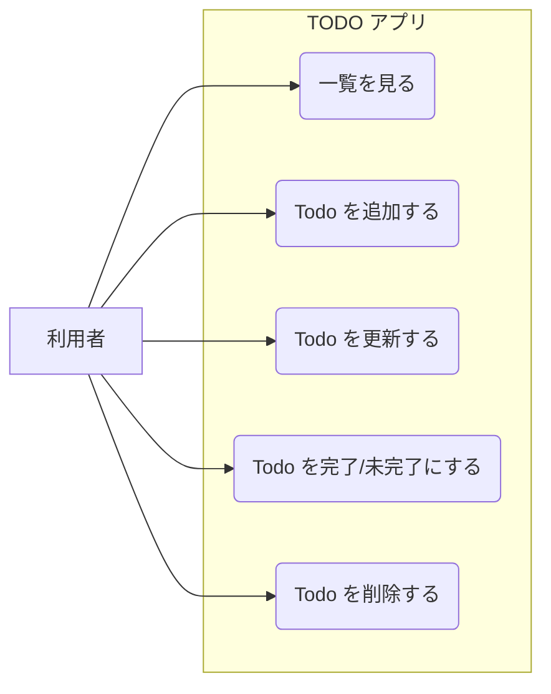
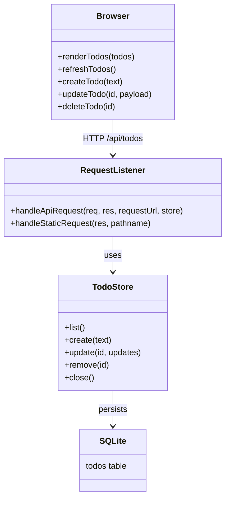
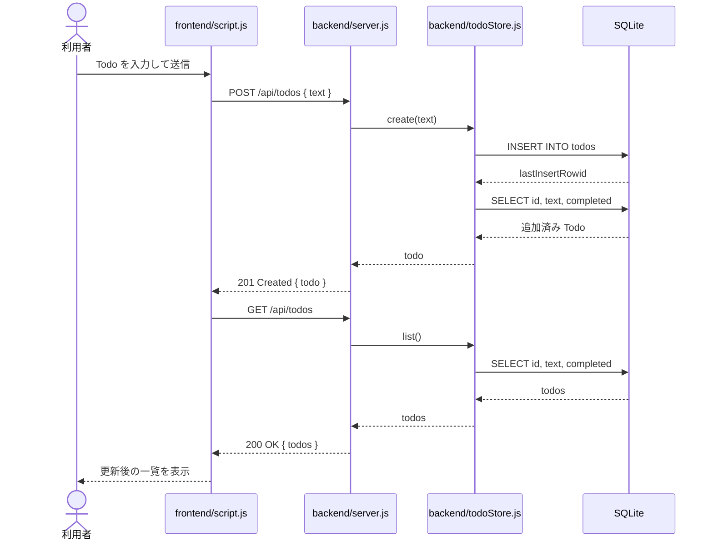

# TODO アプリ

フロントエンドとバックエンドを分離し、Todo を CRUD API 経由で操作する構成です。バックエンドの保存先には SQLite を使います。

## 構成

```text
todo-example/
├── backend/
│   ├── server.js
│   ├── server.test.js
│   ├── todoStore.js
│   └── todoStore.test.js
├── frontend/
│   ├── index.html
│   ├── script.js
│   └── style.css
├── package.json
└── README.md
```

## API

- `GET /api/todos` : Todo 一覧取得
- `POST /api/todos` : Todo 追加
- `PUT /api/todos/:id` : Todo 更新
- `DELETE /api/todos/:id` : Todo 削除

## データ保存

- 実行時の Todo データは `backend/todos.sqlite` に保存されます
- SQLite の初期テーブル作成はアプリ起動時に自動で行われます
- 初回起動時のみサンプル Todo を投入します

## UML 図

参考: [UMLの８種類を解説（クラス図、シーケンス図、アクティビティ図など）](https://products.sint.co.jp/ober/blog/uml-type)

参考記事で紹介されている UML のうち、この Todo アプリでは「利用者が何をできるか」を整理するユースケース図、「主要な責務と依存関係」を示すクラス図、「Todo を追加するときの処理順序」を示すシーケンス図が特に有効です。

### ユースケース図



### クラス図



### シーケンス図



## 実行方法

```bash
npm start
```

`http://localhost:3000` にアクセスすると、`frontend/` の画面が表示されます。

## テスト

```bash
npm test
```

`todoStore` の単体テストと、CRUD API の疎通テストを実行します。
